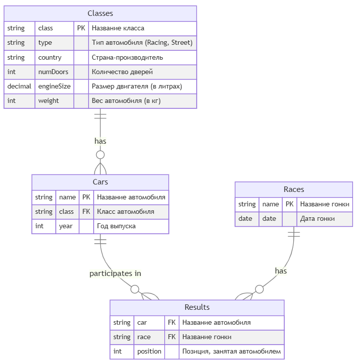

# Домашнее задание по дисциплине "Базы данных"


## 1. Описание проекта

- **Цель**: выполнение учебных задач по курсу "Базы данных", написание SQL-запросов
- **СУБД**: задание выполнено с использованием СУБД PostgreSQL  

Задание состоит из четырёх отдельных группы задач, для решения которых созданы четыре базы данных и написаны скрипты для создания и заполнения таблиц.    

Краткое описание задач (под спойлером):  
- Транспортные средства - Vehicle
    - <details>
        <summary>Задача 1</summary>
            Найдите производителей (maker) и модели всех мотоциклов, которые имеют мощность более 150 лошадиных сил, стоят менее 20 тысяч долларов и являются спортивными (тип Sport). Также отсортируйте результаты по мощности в порядке убывания.
      </details>
    - <details>
        <summary>Задача 2</summary>
            Найти информацию о производителях и моделях различных типов транспортных средств (автомобили, мотоциклы и велосипеды), которые соответствуют заданным критериям.
      </details>

- Автомобильные гонки - Races
    - <details>
        <summary>Задача 1</summary>
            Определить, какие автомобили из каждого класса имеют наименьшую среднюю позицию в гонках, и вывести информацию о каждом таком автомобиле для данного класса, включая его класс, среднюю позицию и количество гонок, в которых он участвовал. Также отсортировать результаты по средней позиции.
      </details>
    - <details>
        <summary>Задача 2</summary>
            Определить автомобиль, который имеет наименьшую среднюю позицию в гонках среди всех автомобилей, и вывести информацию об этом автомобиле, включая его класс, среднюю позицию, количество гонок, в которых он участвовал, и страну производства класса автомобиля. Если несколько автомобилей имеют одинаковую наименьшую среднюю позицию, выбрать один из них по алфавиту (по имени автомобиля).
      </details>
    - <details>
        <summary>Задача 3</summary>
            Определить классы автомобилей, которые имеют наименьшую среднюю позицию в гонках, и вывести информацию о каждом автомобиле из этих классов, включая его имя, среднюю позицию, количество гонок, в которых он участвовал, страну производства класса автомобиля, а также общее количество гонок, в которых участвовали автомобили этих классов. Если несколько классов имеют одинаковую среднюю позицию, выбрать все из них.
      </details> 
    - <details>
        <summary>Задача 4</summary>
            Определить, какие автомобили имеют среднюю позицию лучше (меньше) средней позиции всех автомобилей в своем классе (то есть автомобилей в классе должно быть минимум два, чтобы выбрать один из них). Вывести информацию об этих автомобилях, включая их имя, класс, среднюю позицию, количество гонок, в которых они участвовали, и страну производства класса автомобиля. Также отсортировать результаты по классу и затем по средней позиции в порядке возрастания.
        </details>
    - <details>
        <summary>Задача 5</summary>
            Определить, какие классы автомобилей имеют наибольшее количество автомобилей с низкой средней позицией (больше 3.0) и вывести информацию о каждом автомобиле из этих классов, включая его имя, класс, среднюю позицию, количество гонок, в которых он участвовал, страну производства класса автомобиля, а также общее количество гонок для каждого класса. Отсортировать результаты по количеству автомобилей с низкой средней позицией.
      </details>     

- Бронирование отелей - Booking
    - <details>
        <summary>Задача 1</summary>
            Определить, какие клиенты сделали более двух бронирований в разных отелях, и вывести информацию о каждом таком клиенте, включая его имя, электронную почту, телефон, общее количество бронирований, а также список отелей, в которых они бронировали номера (объединенные в одно поле через запятую с помощью CONCAT). Также подсчитать среднюю длительность их пребывания (в днях) по всем бронированиям. Отсортировать результаты по количеству бронирований в порядке убывания.
      </details>
    - <details>
        <summary>Задача 2</summary>
            Провести анализ клиентов, которые сделали более двух бронирований в разных отелях и потратили более 500 долларов на свои бронирования.
      </details>
    - <details>
        <summary>Задача 3</summary>
            Провести анализ данных о бронированиях в отелях и определить предпочтения клиентов по типу отелей.
      </details>     

- Структура компании - Company
    - <details>
        <summary>Задача 1</summary>
            Найти всех сотрудников, подчиняющихся Ивану Иванову (с EmployeeID = 1), включая их подчиненных и подчиненных подчиненных.
      </details>
    - <details>
        <summary>Задача 2</summary>
            Найти всех сотрудников, подчиняющихся Ивану Иванову с EmployeeID = 1, включая их подчиненных и подчиненных подчиненных.
      </details>
    - <details>
        <summary>Задача 3</summary>
            Найти всех сотрудников, которые занимают роль менеджера и имеют подчиненных (то есть число подчиненных больше 0).
      </details>     
    
## 2. Структура проекта

В каждой из четырёх папок содержится скрипты для создания и заполнения таблиц для соответствующей базы данных, а также файлы, содержащие SQL-запросы для получения информации в соответствии с поставленной задачей. 
<details>
<summary>Структура проекта (под спойлером)</summary>

```
Database_Homework
│  
├── DB_01_Vehicle
│   ├── CreateTablesVehicleDB.sql
│   ├── DB_01_Vehicle_Task_01.sql
│   ├── DB_01_Vehicle_Task_02.sql
│   └── InsertDataVehicleDB.sql
├── DB_02_Races
│   ├── CreateTablesRacesDB.sql
│   ├── DB_02_Races_Task_01.sql
│   ├── DB_02_Races_Task_02.sql
│   ├── DB_02_Races_Task_03.sql
│   ├── DB_02_Races_Task_04.sql
│   ├── DB_02_Races_Task_05.sql
│   └── InsertDataRacesDB.sql
├── DB_03_Booking
│   ├── CreateTablesBookingDB.sql
│   ├── DB_03_Booking_Task_01.sql
│   ├── DB_03_Booking_Task_02.sql
│   ├── DB_03_Booking_Task_03.sql
│   └── InsertDataBookingDB.sql
├── DB_04_Company
│   ├── CreateTablesCompanyDB.sql
│   ├── DB_04_Company_Task_01.sql
│   ├── DB_04_Company_Task_02.sql
│   ├── DB_04_Company_Task_03.sql
│   └── InsertDataCompanyDB.sql
├── diagram
│   ├── booking.png
│   ├── company.png
│   ├── races.png
│   └── vehicle.png
└── README.md   
```
</details>

### Схемы баз данных
<details>
<summary>Транспортные средства - Vehicle</summary>


</details>

<details>
<summary>Автомобильные гонки - Races</summary>



</details>

<details>
<summary>Бронирование отелей - Booking</summary>


</details>

<details>
<summary>Структура компании - Company</summary>


</details>

Для просмотра схемы базы данных нажмите на спойлер


## 3. Настройка баз данных

1. **Создание баз данных**  
Для создания базы данных используйте средство PgAdmin4

2. **Создание таблиц**   
Для создания таблиц с помощью Query Tool выполните соответствующий скрипт
    - CreateTablesVehicleDB.sql
    - CreateTablesRacesDB.sql
    - CreateTablesBookingDB.sql
    - CreateTablesCompanyDB.sql

3. **Заполнение таблиц**   
   Для заполнения таблиц с помощью Query Tool выполните соответствующий скрипт
    - InsertDataVehicleDB.sql
    - InsertDataRacesDB.sql
    - InsertDataBookingDB.sql
    - InsertDataCompanyDB.sql
   
4. **Решение задачи**   
   С помощью Query Tool средства PgAdmin4 запустите соответствующий скрипт.